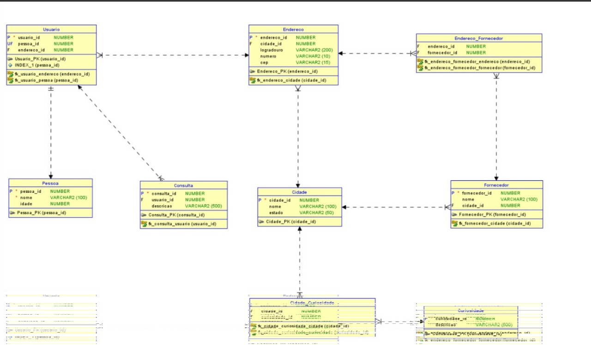

# API - MavidEnergy

# Integrantes do Grupo

- **RM553351 - Diego Cavalcanti** - Responsável pela criação da aplicação
- **RM553352 - Mateus Galeazi** - Responsável pela documentação
- **RM553483 - Vitor de Melo** - Responsável pelos diagramas e o banco

---

## Link do Vídeo

[Link do vídeo Pitch](https://youtu.be/34552LLUbrE)
[Link do vídeo Demonstrativo](https://youtu.be/YFmJ1B3Nsc8)

---

## Instruções de Como Rodar a Aplicação
A aplicação foi desenvolvida utilizando com o MySQL como banco de dados padrão. Para rodar a aplicação, siga os seguintes passos:

**Configurar o Banco de Dados:**

- Certifique-se de que o MySQL está instalado e em execução na sua máquina.
- Crie um banco de dados chamado **mavidenergy** no MySQL.
- Configure as credenciais do banco de dados no arquivo de configuração da aplicação, que está localizado em **src/main/resources/application.yml**.
- Com o banco de dados configurado, basta rodar a aplicação localmente.

  **Utilizar Outro Banco de Dados (opcional):**

- Se preferir utilizar outro banco de dados, como PostgreSQL ou H2, você pode alterar as credenciais e a URL de conexão no arquivo de configuração **(application.properties ou application.yml)** de acordo com o banco de dados escolhido.

**INSERTS DO BANCO DE DADOS**

**Foi criado um arquivo .sql com os inserts a serem inseridos pois a quantiade de inserts iriam deixar o READM muito grande, basta rodar o arquivo no banco escolhido para serem inseridos no bando de Dados, ja estão na ordem certa**

---

Para ver o Design de como sera o aplicativo que ira consumir essa api basta eentrar no link do nosso figma:
[Link do Figma](https://www.figma.com/design/4bx75eN1M9FAVrgjqOlCOu/MavidEnergyApp?node-id=0-1&t=Rw9NU99YLYA2EN91-1)

---

Para mais detalhes de nossa api juntamente com documentação, pode acessar o nosso swagger:
[Link do Swagger](http://localhost:8080/swagger-ui/index.html)

## Diagramas

Aqui você deve inserir os dois diagramas.

1. Diagrama de Classes:
   
---

## Endpoints

### Cidades
- `GET /cidades` - Retorna todas as cidades.
- `GET /cidades/{cidadeId}/dados-climaticos` - Retorna os dados climaticos de uma cidade.
- `GET /cidades/{cidadeId}` - Retorna uma cidade.

### Consulta
- `GET /consulta/{consultaId}` - Retorna uma consulta.
- `GET /consulta/pessoa/{pessoaId}` - Retorna as consultas de uma pessoa.
- `POST /consulta` - Adiciona uma consulta atrelada a cliente e endereço.
{
  "bandeira":corBandeira, sendo apenas "verde, amarela ou vermelha",
  "valorKwh": valor kwh em Double,
  "pessoaId": id da pessoa que esta fazendo a consulta,
  "enderecoId" id do endereco que esta sendo usado na consulta
}

### Endereco
- `POST /enderecos` - Adiciona um endereco atrelado a um cliente e uma cidade.
{
    "cep" : cep,
    "logradouro": logradouro,
    "numero": numero,
    "latitude": latitude,
    "longitude": longitude,
    "cidadeId": id da cidade,
    "pessoaId": ida da pessoa
 }
- `GET /enderecos/{enderecoId}` - Retorna um endereço.
- `GET /enderecos/pessoa/{pessoaId}` - Retorna os endereços de uma pessoa.
- `PUT /enderecos/{enderecoId}` - Atualiza um endereço.
{
    "cep" : cep,
    "logradouro": logradouro,
    "numero": numero,
    "latitude": latitude,
    "longitude": longitude,
    "cidadeId": id da cidade,
    "pessoaId": ida da pessoa
 }
- `DELETE /enderecos/{enderecoId}` - Apaga todas as consultas atreladas a um endereço e logo em seguida apaga o endereco

### Fornecedor
- `GET /fornecedores/proximos?latitude=latitude&longitude=longitude`} - Retorna todos os fornecedores mais proximos.
- `GET /fornecedores/proximos-paginados?latitude=latitude&longitude=longitude&page=0&size10` - Retorna todos os fornecedores mais proximo e paginado.

### Pessoa
- `GET /pessoa` - Retorna todas as pessoas com usuario.
- `GET /pessoa/{pessoaId}` - Retorna uma pessoa com usuario.
- `POST /pessoa` - cria uma pessoa com usuario.
{
  "nome": nome,
  "email": email,
  "senha": senha
 }

---

## Tecnologias Utilizadas

- **Java 11/17**
- **Spring Boot**
- **MySQL**
- **Hibernate/JPA**
- **Lombok**
- **Postman** (para testar a API)
- **Maven** (para gerenciamento de dependências)
